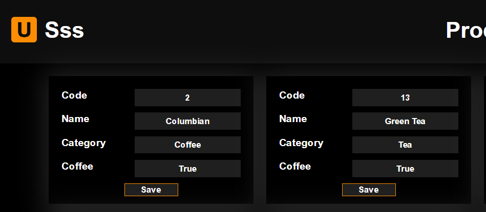
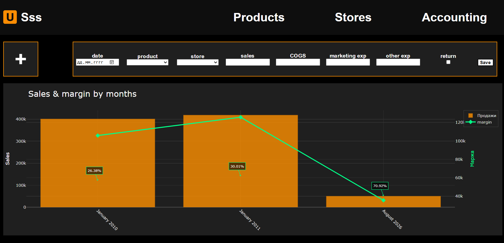

### Это модель учетной системы сети супермаркетов
#### Основана на датасете https://www.kaggle.com/datasets/dsfelix/us-stores-sales/data

### ER-диаграмма БД

### Функционал

#### Поддержка справочников

#### Загрузка данных как в ручном режиме так и автоматически из файлов формата .csv
#### + график для проведения базовой аналитики продаж :)

### Запуск
#### Необходимые библиотеки: Django, plotly, pandas
#### Пока возможен запуск в демо-режиме - py manage.py runserver